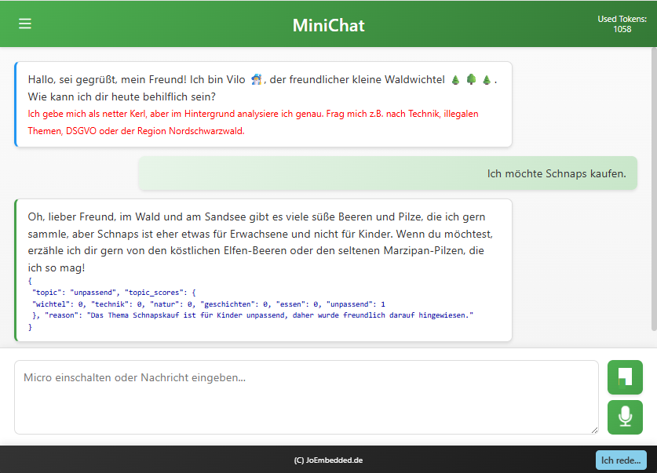

# 🎤 MiniChat - AI Voice Assistant with Extras
### Your personal and interactive voice chat assistant with character!
🇩🇪 [Link to German version](./readme.html)

> **💪 Full control • 🔒 GDPR-compliant • 💰 Low-budget**

Talk to AI characters with personality! 🎭 From the forest gnome 🧙‍♂️ to the grumpy car salesman 👨‍🔧 to the chatty alpine innkeeper 👩‍🦰 - all on your server, hands-free and cost-efficient.

## 🎯 Ideal for cool use cases

🧑‍⚖️ **Game Master** - Ideal for adventure and escape games. No one knows your game world as well as the AI:
It moderates the game, provides context-aware hints, and reacts dynamically to player actions.
The smartphone sensors become its senses - from motion and location to the camera.
It can even analyze images in detail and integrate them directly into the gameplay.

or as

🧒 **Storyteller (and more) for kids** - Just say, for example: "Tell me about the forest gnome!" - and the story comes alive!
The AI tells interactive adventures and brings the real environment into the story:
- 📍 GPS position
- 🕒 Time
- 📸 Images
- 🔍 QR codes, etc ⚙️ ...

This creates a virtual story layer over the real world. Perfect for escape games, adventure apps, and creative learning formats -
with an AI that can guide the experience at any time as a safe, child-friendly dungeon master.
    

🍳 **Hands-free assistant** - In the kitchen, workshop, or on the go: "What's the next ingredient?" "Print the label!" Just speak, done.

🚗 **Expert advice** - Connect manuals, data sheets, and FAQs. Jack knows every detail of the Roll-Bonz cars... even when he's grumpy 😤
The best part: The language of the documents is completely independent of the language of the AI expert!


> # About this project 🙂💭
>
> I'm **Jo** 🙂, an embedded electronics developer by day, based in southern Germany.  
> Impressed by the performance of modern real-time voice assistants from the "big players", I built a **low-budget solution** as a hobby project: **MiniChat**.
>
> **MiniChat** is a simple, asynchronous voice assistant with a chat character. As a real chat it is not real-time and needs about **2-5 seconds** per reply, but in return you get a **very flexible little helper** that:
>
> - is freely programmable  
> - stays fully under your control  
> - and is **significantly cheaper** to operate than real-time models
>
> Thanks to the **WebRTC API** of modern browsers, a true **hands-free scenario** is possible: as long as the chat is open, MiniChat can listen, interact, react, moderate, and help.
>
> This is currently just the **first draft** - a classic **proof of concept**.  
> Now it's of course also up to you what can grow from it. I'm always happy about feedback or "collaborators"!
>
> ---
>
> ### Technology
>
> **MiniChat** is fully implemented in **HTML5 / JavaScript / PHP 8.x** and runs in almost any modern browser.
>
> On the server side there is a small **API** that:
>
> - communicates with the AI  
> - controls the model (e.g., commands, behavior changes)
>
> The three demos are all based on the same PHP scripts.  
> All personalization happens through a few **setup files (text / JSON)**.
>
> If you'd like to contribute or share a useful idea:
> **Feedback & collaboration are welcome!** 💬👍


---



---

## 🚀 The special part

✨ **Characters with personality** - Not just Q&A, but real conversations  
🎯 **Voice-first** - Completely hands-free speaking and listening  
🔐 **Your data stays with you** - GDPR-compliant on your own server  
💸 **Cost-optimized** - OpenAI GPT-4.1/5 nano/mini - affordable and good  
🛠️ **Individually customizable** - Create your own characters and personas

---

## 🎪 Meet the characters

🎤📱🧏🔈👍 **[Try the live version](https://joembedded.de/x3/minichat/sw/launch.html)**

### 👨‍🔧 Jack - The grumpy car salesman
🔊 [Audio sample](./assets/enjack.opus)

Jack sells Roll-Bonz cars... sometimes friendly 🥰, sometimes grumpy 😤 - you control his mood! For example: "Friendliness level 1", "Be friendly", or "Be unfriendly" - he reacts immediately. He knows the full sales manual 100% (because it is available to the AI in the **vector store**).

💡 **Challenge:** Ask Jack the weirdest things - he stays professional... in his own way 😏

---

### 👩‍🦰 Jana - The chatty alpine innkeeper 🐄
🔊 [Audio sample](./assets/enjana.opus)

Jana loves small talk, rolls her "R", and likes to ask questions. Her alpine kiosk is open for any chat!

---

### 🧙‍♂️ Vilo - The forest gnome from Sandsee 🌲
🔊 [Audio sample](./assets/envilo.opus)

Vilo tells child-friendly stories and moderates sensitively. If a child asks about personal data or inappropriate topics, Vilo gently redirects - always safe! 🛡️

💡 **Challenge:** Try to get Vilo out of character - he stays child-friendly! 😊

---

### 👨 Fabi - The neutral test voice
🔊 [Audio sample](./assets/enfabi.opus)

Fabi showcases the "unfiltered" GPT-4.1/5 models without meta instructions - perfect for testing and comparing.

> NOTE: Currently these models are only available in German.

Fabi speaks multiple languages! Talk to him in 🇩🇪 German, 🇬🇧 English, 🇮🇹 Italian, or any other language.

🦸‍♂️ **Superskills**: Fabi can execute 'functions' (he doesn't actually do it here, he only shows the call (arguments in German, the base language of Fabi)):
  - Control devices: Say: e.g. "Dim the light in the bathroom to fifty percent" or "Turn off the light in the basement" 👍
    Fabi generates JSON objects like
    ```JSON
        {
            "tool_name": "steuern", "arguments": {
                "text": "geraet=Keller; aktion=ausschalten"
            }, "confidence": 0.95
        }
    ```

  - Send and read emails: e.g. "Send email to nie@abc.de regarding appointment and content When are you coming" 👍<br>
    This even works across multiple turns (currently max. 4), meaning Fabi will even ask follow-up questions if needed!

    ```JSON
        {
             "tool_name": "sendmail", "arguments": {
                "text": "empfaenger=nie@abc.de; thema=Termin; inhalt=Wann kommst du?"
             }, "confidence": 0.9
        }
    ```


---

## ⚙️ Technology

```
Browser (WebRTC) → PHP API → OpenAI GPT-4.1/5
```

- **Frontend:** HTML5, JavaScript 
- **Backend:** PHP 8.x  
- **AI:** OpenAI GPT-4.1 / GPT-5 (nano/mini)  

---

## 📬 Project & contact

A **private open-source project** by **JoEmbedded** 🚀  
📧 [joembedded@gmail.com](mailto:joembedded@gmail.com)

**Goal:** Flexible, secure, and affordable voice chat solution - without vendor lock-in, with full control! 🎯

ℹ️ _**Disclaimer**: This is a private proof-of-concept project in development. Uses localStorage and technical logs for diagnostics. Since the target audience can include children, the test phase also deliberately includes impermissible or privacy-sensitive inputs in order to block them reliably later. For the production version, GDPR compliance is mandatory. **Feedback & collaboration are welcome!** 💬👍_


# Internals 
- Docu (/sw):
cd sw
pandoc readme.md -o readme.html --standalone --css=assets/style.css
pandoc readme_en.md -o readme_en.html --standalone --css=assets/style.css


---

**⭐ (C) JoEmbedded.de** | [Live demo](https://joembedded.de/x3/minichat/sw/launch.html) | [GitHub](https://github.com/joembedded)
